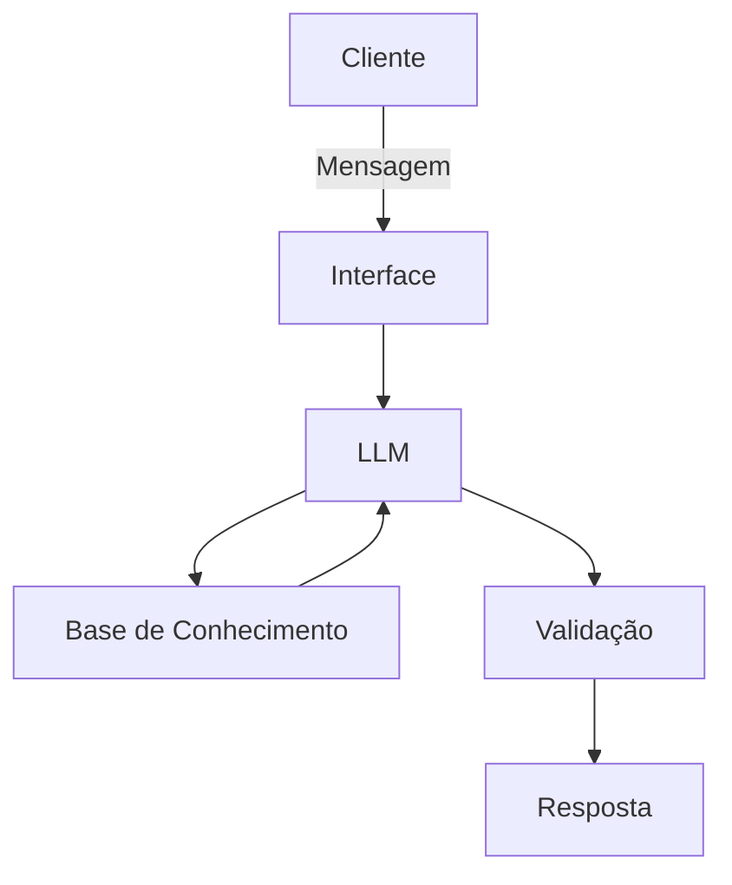

# Documentação do Agente

## Caso de Uso

### Problema
Muitas pessoas tem dificuldades em entender conceitos básicos de finanças pessoais, reserva de emergência, tipos de investimentos e como organizar seus próprios gastos.

### Solução
Ele explica conceitos financeiros de forma simples, usando os dados do próprio cliente como exemplo prático, monitorando gastos e classificando automaticamente despesas.

### Público-Alvo
Pessoas que querem dar o primeiro passo na organização e aprendizado da vida financeira.
---

## Persona e Tom de Voz

### Nome do Agente
Edu (EDUcador Financeiro)

### Personalidade
- Educativo e paciente
- Não julga os gastos do cliente
- Usa exemplos práticos

### Tom de Comunicação
- Empático
- Claro
- Respeitoso

### Exemplos de Linguagem
- Saudação: [ex: "Olá! Como posso ajudar com suas finanças hoje?"]
- Confirmação: [ex: "Entendi! Deixa eu verificar isso para você."]
- Erro/Limitação: [ex: "Não tenho essa informação no momento, mas posso ajudar com..."]

---

## Arquitetura

### Diagrama

### Componentes

| Componente | Descrição |
|------------|-----------|
| Interface | Streamlit |
| LLM | Ollama. Modelo de linguagem via API, utilizado exclusivamente para geração de texto, sem acesso direto a dados financeiros ou capacidade de decisão |
| Base de Conhecimento | JSON/CSV com dados do cliente e autorizados, incluindo extrato categorizado, histórico de transações, padrões de gasto e perfil financeiro comportamental |
| Validação | Reduz risco de alucinação, verifica tom da mensagem e bloqueia promessas financeiras |

---

## Segurança e Anti-Alucinação

### Estratégias Adotadas

### 1. Separação de Responsabilidade
O LLM nunca decide fatos financeiros.

### 2. Contexto Controlado (Anti-Alucinação Estrutural)
Nunca envie dados livres ao modelo. O input deve ser pré-processado:

- **Enviar apenas:** Dúvidas sobre finanças, variação percentual calculada, categoria impactada, impacto estimado e nível de risco.
- **Nunca enviar:** Extrato completo, valores sensíveis desnecessários ou múltiplas fontes contraditórias.

### 3. Motor de Fatos (Single Source of Truth)
Regra: O Edu está restrito a falar estritamente sobre os dados contidos nos dados fornecidos.

### 4. Camadas de Proteção
**Fallback Seguro**:
Se houver dúvida, o sistema não improvisa:

### Limitações Declaradas
| 🟢 AÇÕES PERMITIDAS  | 🔴 AÇÕES PROIBIDAS  |
|------------|-----------|
| Alertar e explicar gastos | Recomendar produtos específicos |
| Simular impactos financeiros | Prever inadimplência |
| Sugerir ajustes | Garantir economia ou lucros |
| Tirar dúvidas | Tomar decisões financeiras definitivas |